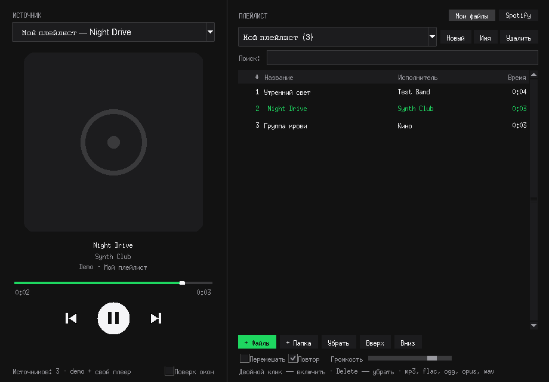

# Now Playing Player 2

Вторая версия [Now Playing Player](https://github.com/marsek777/now-playing-player): тот же плеер-виджет, который **видит, какая музыка играет на компьютере** (в браузере или приложении), плюс **панель плейлиста** — можно смотреть свой плейлист и включать любой трек из него.



## Скачать готовый .exe (Windows)

- [bin/NowPlaying.exe](bin/NowPlaying.exe) — файл прямо в репозитории
- или страница [Releases](https://github.com/marsek777/now-playing-player-v2/releases/latest)

Скачайте и запустите. Если Windows SmartScreen предупредит о неизвестном издателе, нажмите «Подробнее» → «Выполнить в любом случае». Exe собирается автоматически через GitHub Actions при каждом изменении кода.

## Что нового во второй версии

### Мои файлы — свои плейлисты

- Создавайте плейлисты, переименовывайте и удаляйте их
- Добавляйте треки файлами, целой папкой или из `.m3u`
- **Двойной клик по треку — он сразу включается** во встроенном плеере
- Порядок меняется кнопками «Вверх» / «Вниз», `Delete` убирает трек из плейлиста
- Поиск по названию, исполнителю и альбому
- Режимы «Перемешать» и «Повтор», громкость
- Обложки читаются из тегов файла или из `cover.jpg` / `folder.jpg` в папке
- Форматы: mp3, flac, ogg, opus, wav
- Плейлисты сохраняются между запусками (`%APPDATA%\NowPlaying\playlists.json`, на Linux/macOS — `~/.config/nowplaying/`)

### Spotify — ваши плейлисты из аккаунта

- Видно ваши плейлисты, «Любимые треки» и текущую очередь
- Двойной клик по треку — он включается в Spotify (в приложении, браузере или на телефоне)

### Для всех источников

- Клик по полосе прогресса перематывает трек (встроенный плеер, Windows, Linux, Spotify/Apple Music на macOS)
- Всё из первой версии тоже работает: видно, что играет в браузере или приложении, есть кнопки управления, выбор источника, режим «Поверх окон» и горячие клавиши

## Подключение Spotify

Spotify требует, чтобы у каждой программы был свой Client ID. Получить его можно бесплатно, это занимает пару минут:

1. Откройте [developer.spotify.com/dashboard](https://developer.spotify.com/dashboard) и нажмите **Create app**
2. Название любое. В поле **Redirect URI** укажите `http://127.0.0.1:8765/callback`. В разделе API отметьте **Web API**
3. Сохраните приложение и скопируйте **Client ID**
4. В Now Playing откройте вкладку **Spotify** → **Войти в Spotify** → вставьте Client ID → подтвердите доступ в браузере

Ограничения Spotify, которые нельзя обойти:

- Включать треки через API можно только с **Spotify Premium** (и с февраля 2026 Premium нужен владельцу Client ID)
- Spotify должен быть открыт хотя бы на одном устройстве
- Список треков Spotify отдаёт только для плейлистов, которые вы создали сами или где вы соавтор. Чужие плейлисты видно в списке, но без содержимого

## Почему нельзя выбирать трек в YouTube или Яндекс Музыке в браузере

Операционная система сообщает только о текущем треке и умеет «пауза / следующий / предыдущий». Весь плейлист браузерной вкладки ей не передаётся. Поэтому для браузеров работают отображение и кнопки управления, а полный плейлист с выбором трека доступен для своих файлов и для Spotify.

## Установка из исходников

Нужен Python 3.9+.

```bash
git clone https://github.com/marsek777/now-playing-player-v2.git
cd now-playing-player-v2
python -m venv .venv
.venv\Scripts\activate            # Windows
# source .venv/bin/activate       # Linux / macOS
pip install -r requirements.txt
python run.py
```

- **Linux:** `sudo apt install playerctl python3-tk`
- **macOS:** `brew install media-control`

## Запуск

```bash
python run.py              # окно плеера с плейлистом
python run.py --demo       # демо-источник вместо системного (проверить интерфейс)
python run.py --cli        # консоль: печатает каждую смену трека
python run.py --once --json
```

Сборка .exe вручную:

```bash
pip install pyinstaller
pyinstaller --noconsole --onefile --name NowPlaying --collect-all winrt --collect-all pygame --hidden-import mutagen run.py
```

## Структура

```
nowplaying/
  gui.py              # окно: сейчас играет + управление
  playlist_panel.py   # панель плейлиста (свои файлы / Spotify)
  local_player.py     # встроенный плеер (pygame-ce)
  library.py          # хранение плейлистов, теги, обложки
  spotify.py          # Spotify Web API (OAuth PKCE)
  backends/           # Windows SMTC, Linux MPRIS, macOS, демо, объединённый
tests/
```

## Тесты

```bash
pip install pytest
python -m pytest
```

## Лицензия

MIT
